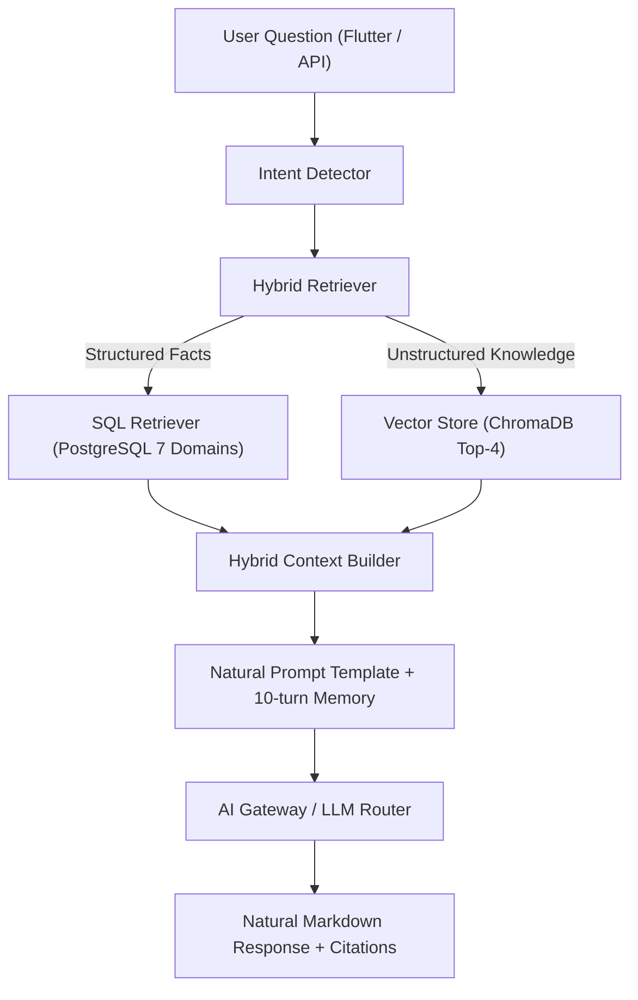

# Walkthrough - AI Personal Finance RAG Chatbot (V1)

We have built and verified the complete **AI Financial Assistant (RAG Chatbot)** module integrated into the `apps/api` FastAPI backend service.

## Architecture Overview



---

## Key Modules Created & Updated

### 1. RAG Knowledge & Vector Indexing (`apps/api/app/ai/rag/`)
- [`knowledge_docs.py`](file:///d:/Projects/ai-personal-finance/ai-personal-finance-app/apps/api/app/ai/rag/knowledge_docs.py): Seed knowledge base covering the 50/30/20 rule, emergency funds, debt snowball/avalanche methods, eating out saving tips, and app FAQs.
- [`vector_store.py`](file:///d:/Projects/ai-personal-finance/ai-personal-finance-app/apps/api/app/ai/rag/vector_store.py): Implemented document loader, text cleaner, recursive text splitter (`chunk_size=400`, `chunk_overlap=120`), and ChromaDB Vector Store with top-4 similarity search and fallback vector engine.
- [`memory.py`](file:///d:/Projects/ai-personal-finance/ai-personal-finance-app/apps/api/app/ai/rag/memory.py): `RAGMemoryStore` maintaining bounded 10-turn conversation history per user session.
- [`prompts.py`](file:///d:/Projects/ai-personal-finance/ai-personal-finance-app/apps/api/app/ai/rag/prompts.py): System & user prompt templates enforcing friendly conversational tone, forbidding robotic phrases (*"Dựa trên dữ liệu...", "Theo tài liệu..."*), enforcing structured Markdown output (`## Câu trả lời`, `## Phân tích nhanh`, `## Gợi ý cho bạn`, `## Nguồn`), and anti-hallucination policies.
- [`generator.py`](file:///d:/Projects/ai-personal-finance/ai-personal-finance-app/apps/api/app/ai/rag/generator.py): Financial RAG Engine coordinating intent detection, parallel retrieval, memory, prompt formatting, gateway execution, actionable insight generation, and citations.

### 2. Structured & Hybrid Retrievers (`apps/api/app/ai/retrievers/`)
- [`sql_retriever.py`](file:///d:/Projects/ai-personal-finance/ai-personal-finance-app/apps/api/app/ai/retrievers/sql_retriever.py): Structured retriever extracting real user data from PostgreSQL across 7 domains: Transactions, Accounts, Budgets, Categories, Income, Saving Goals, Notifications.
- [`intent_detector.py`](file:///d:/Projects/ai-personal-finance/ai-personal-finance-app/apps/api/app/ai/retrievers/intent_detector.py): Classifies queries into `spending_analysis`, `affordability`, `saving_advice`, `knowledge`, and `budget_review`.
- [`hybrid_retriever.py`](file:///d:/Projects/ai-personal-finance/ai-personal-finance-app/apps/api/app/ai/retrievers/hybrid_retriever.py): Combines SQL Retriever and Chroma Vector Store search into a unified `HybridContext` adhering strictly to data priority (1. PostgreSQL User Data, 2. RAG Knowledge, 3. LLM Base).

### 3. API Integration (`apps/api/app/ai/routes.py`)
- Updated `POST /api/v1/ai/query` to execute `FinancialRAGGenerator.generate_response()` and record multi-turn chat messages with rich metadata.

---

## Verification & Test Results

Executed automated unit and integration tests via Pytest:

```bash
..\..\.venv\Scripts\python.exe -m pytest tests/test_rag_chatbot.py tests/test_phase14_ai_features.py tests/test_ai_platform.py -v -m "not postgres"
```

### Results Summary
- **31 test cases PASSED** (0 failures).
- Verified recursive text splitting parameters (`chunk_size=400`, `chunk_overlap=120`).
- Verified Chroma vector store similarity retrieval.
- Verified intent classification logic.
- Verified 10-turn bounded conversation memory retention.
- Verified AI platform security, rate limiting, and prompt injection defenses.
