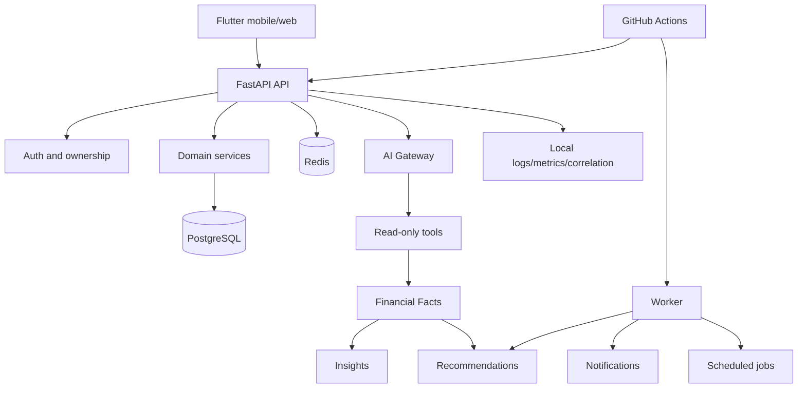

# Final Architecture

| Component | Status |
|---|---|
| Flutter -> API -> PostgreSQL | IMPLEMENTED / LOCAL ONLY |
| AI gateway/read-only facts/insights/recommendations | IMPLEMENTED / LOCAL ONLY |
| Worker notifications/recommendations/jobs | IMPLEMENTED / LOCAL ONLY |
| Redis | LOCAL ONLY |
| Storage/object storage | EXTERNAL / DEFERRED |
| Prometheus/Grafana/OTel/error provider | EXTERNAL / DEFERRED |
| CI/CD hosted promotion | EXTERNAL / NOT VERIFIED |
